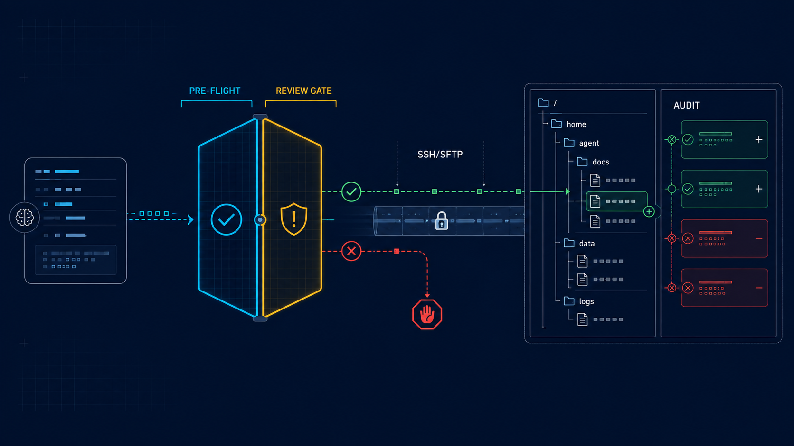
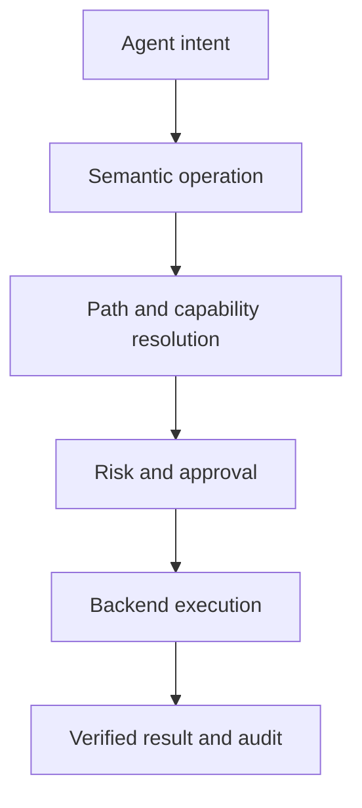

# AgentFileOps

<p align="center">
  
</p>

<p align="center">
  <strong>Give agents files, not a shell.</strong><br>
  Safe remote filesystem operations for AI agents and MCP clients
</p>

<p align="center">
  <em>SSH/SFTP · transfer · sync · deployment · approvals · audit trails</em>
</p>

<p align="center">
  <a href="https://github.com/AvaTar-ArTs/AgentFileOps/actions/workflows/foundation.yml"></a>
  <a href="https://github.com/AvaTar-ArTs/AgentFileOps/actions/workflows/pages.yml"></a>
  <a href="AUDIT_REPORT.md"></a>
  <a href="LICENSE"></a>
</p>

> [!WARNING]
> AgentFileOps is under active development. The foundation contracts and first Rust conformance slice exist; broader SSH/SFTP runtime, SDK, MCP, package, and production-readiness claims remain in progress.

**Category:** Remote File Operations for AI Agents.

## The idea

A shell asks an agent to invent commands. AgentFileOps asks an agent to declare intent.

The protocol turns remote file work into a reviewable lifecycle:



The protocol is canonical. Rust, CLI, MCP, SDK, daemon, and skills surfaces are replaceable implementations or adapters.

## What it covers

| Capability | Purpose |
|---|---|
| Remote filesystem | list, stat, find, read, write, and manage files |
| Transfer | bounded uploads, downloads, checksums, and artifact movement |
| Deployment | planned publication, target snapshots, approvals, and rollback intent |
| Sync | manifest-driven reconciliation with conflict and deletion controls |
| Safety | L0–L4 risk classification, preflight plans, fingerprints, and revalidation |
| Transport | provider-neutral SSH/SFTP connection and backend strategy |
| Audit | normalized results and decision records for reviewable operations |

No public AgentFileOps interface should expose arbitrary `exec(command: string)`.

## Safety model

| Level | Meaning | Examples | Control |
|---|---|---|---|
| L0 | Read-only | list, stat, find, read, checksum | Automatic |
| L1 | Additive | mkdir, new upload, copy to a new path | Policy-dependent |
| L2 | Replacement | overwrite, move, chmod, symlink | Review recommended |
| L3 | Destructive | single delete | Explicit approval |
| L4 | High impact | recursive delete, bulk delete, sync with deletion | Staged approval |

Safety boundaries:

- credentials are references, never embedded secrets;
- unknown or mismatched SSH host keys fail closed;
- recursive operations default to `follow_symlinks=false`;
- high-risk mutations require a plan, target resolution, and revalidation;
- a successful document or test placeholder is not proof of runtime completeness.

## Current state

### Foundation implemented

- canonical protocol schemas and path/risk contracts;
- Rust workspace and foundation CLI surface;
- discovery, source-lock, capability, and skill manifests;
- foundation and skill validators;
- Vertical Slice 01 behavioral tests;
- Vertical Slice 02 connection/path/backend strategy tests;
- architecture, security, audit, design, and visual documentation.

### In progress

- live SSH/SFTP connection and backend execution;
- real SSH/SFTP transport behavior;
- strict host-key verification implementation;
- bounded remote reads and additive writes;
- integration fixtures;
- MCP and SDK adapters.

### Not released

- published npm, Python, Go, or Docker packages;
- a stable public CLI distribution;
- destructive delete, archive, and sync runtime behavior;
- production-readiness certification.

## Verify the repository

```bash
git clone https://github.com/AvaTar-ArTs/AgentFileOps.git
cd AgentFileOps

python scripts/validate_foundation.py
python scripts/validate_skills.py
python scripts/validate_source_lock.py
python scripts/validate_repository_assets.py

cargo fmt --all -- --check
cargo clippy --workspace --all-targets --all-features -- -D warnings
cargo test --workspace --all-targets

python -m pip install --upgrade pytest
python -m pytest tests/conformance/test_vertical_slice_01.py \
  tests/conformance/test_vertical_slice_02.py \
  tests/conformance/test_vertical_slice_03.py -v -ra
```

Vertical Slice 02 is implemented as a semantic, no-network conformance slice. Vertical Slice 03 remains an explicit skipped placeholder until live SSH/SFTP operations and integration fixtures are available.

## Read next

| Question | Document |
|---|---|
| What is the canonical project map? | [Repository Index](docs/REPOSITORY_INDEX.md) |
| What are the system boundaries? | [Architecture](ARCHITECTURE.md) |
| What is forbidden or safety-sensitive? | [Security policy](SECURITY.md) |
| What is actually demonstrated? | [Foundation audit](AUDIT_REPORT.md) |
| How does it compare with adjacent tools? | [Comparator review](docs/research/COMPARATOR_REVIEW.md) |
| What names and package targets are reserved? | [Discovery manifest](manifests/discovery.json) |
| How are agent skills defined? | [Skill contracts](skills/) |
| What are the visual assets and their authority boundaries? | [Visual gallery](docs/assets/README.md) |
| Where is the live documentation surface? | [Pages dashboard](docs/site/index.html) |

## Ecosystem

AgentFileOps is developed with the AvaTar-ArTs agent ecosystem:

- [superAgents](https://github.com/AvaTar-ArTs/superAgents) — orchestration, policy, and verification roles;
- [superSkills](https://github.com/AvaTar-ArTs/superSkills) — procedural contracts for development and quality gates;
- [agent-skills](https://github.com/AvaTar-ArTs/agent-skills) — specialist architecture, security, testing, DevOps, and review perspectives.

The working rule is:

```
contract first → specialist review → implementation → verification evidence
```

Imported ecosystem material is adapted and bounded. The AgentFileOps protocol remains authoritative.

## Naming and source history

The project began as `hostinger-file-bridge`, was generalized briefly under `AgentFS`, and was renamed to AgentFileOps after collision research. The original product-design checkpoint is preserved in [the source architecture specification](docs/superpowers/specs/2026-08-18-agentfs-product-design.md).

Hostinger remains a migration and research source, not a product boundary. The protocol is intended for generic SSH/SFTP servers, VPSes, NAS systems, hosting panels, and future adapters.

## License

AgentFileOps is licensed under the [MIT License](LICENSE).
