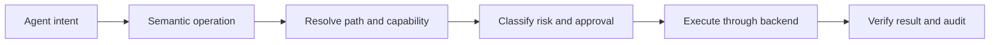

# AgentFileOps

<p align="center">
  
</p>

<p align="center">
  <strong>Give agents files, not a shell.</strong><br>
  Safe, semantic remote filesystem operations for AI agents and MCP clients
</p>

<p align="center">
  <a href="https://github.com/AvaTar-ArTs/AgentFileOps/actions/workflows/foundation.yml"></a>
  <a href="https://github.com/AvaTar-ArTs/AgentFileOps/actions/workflows/pages.yml"></a>
  <a href="https://img.shields.io/badge/status-foundation%20in%20progress-00C8FF"></a>
  <a href="LICENSE"></a>
</p>

> [!WARNING]
> AgentFileOps is under active development. The protocol, safety model, and first Rust conformance slices are being built now. Planned package names, CLI examples, and future SSH/SFTP runtime work are not released production features.

## The idea

A shell asks an agent to invent commands. AgentFileOps asks an agent to declare intent.

The protocol turns remote file work into a reviewable lifecycle:



This gives agents structured filesystem capabilities—list, stat, find, read, write, transfer, manage, archive, and sync—without exposing a public arbitrary `exec(command)` surface.

## What it is for


AgentFileOps is designed for:

- AI agents and MCP clients that need bounded remote file access;
- coding assistants and automation systems that publish artifacts;
- deployment workflows targeting VPS, NAS, shared hosting, and generic SSH/SFTP servers;
- operators who need plans, approvals, fingerprints, and audit events around mutations.

The protocol is provider-neutral. Hostinger is a research and migration source, not the product boundary.

## Safety is part of the operation

Every operation receives a semantic risk level:

| Level | Meaning | Examples | Control |
|---|---|---|---|
| L0 | Read-only | list, stat, find, read, checksum | Automatic |
| L1 | Additive | mkdir, new upload, copy to a new path | Policy-dependent |
| L2 | Replacement | overwrite, move, chmod, symlink | Review recommended |
| L3 | Destructive | single delete | Explicit approval |
| L4 | High impact | recursive delete, bulk delete, sync with deletion | Staged approval |

Core boundaries:

- credentials are references, never embedded secrets;
- unknown or mismatched SSH host keys fail closed;
- recursive operations default to `follow_symlinks=false`;
- high-risk mutations require a plan, target resolution, and revalidation;
- behavior must be proven by tests or CI evidence, not documentation alone.

## Current status

### Foundation implemented

- canonical schemas for connections, paths, operations, plans, results, and audit events;
- Rust workspace and core path/risk contracts;
- discovery, naming, and source-provenance manifests;
- foundation validation and Vertical Slice 01 fixtures;
- architecture, security, design, and audit documentation;
- Pages dashboard and generated visual campaign assets.

### In progress

- connection and backend-strategy conformance;
- real SSH/SFTP transport;
- strict host-key verification implementation;
- bounded remote reads and additive writes;
- ephemeral OpenSSH/SFTP integration fixtures;
- MCP and SDK adapter surfaces.

### Not released yet

- published npm, Python, Go, or Docker packages;
- a stable public CLI distribution;
- destructive delete, archive, and sync runtime behavior;
- production-readiness certification.

## Try the repository

```bash
git clone https://github.com/AvaTar-ArTs/AgentFileOps.git
cd AgentFileOps

python scripts/validate_foundation.py
python scripts/validate_skills.py
cargo test --workspace --all-targets
python -m pytest tests/conformance/test_vertical_slice_01.py -v
```

Vertical Slices 02 and 03 are intentionally marked as incomplete contract tests. Their skips are visible evidence, not a claim of finished runtime behavior.

## Read the repository as a narrative

Start with:

1. [Repository Index](docs/REPOSITORY_INDEX.md) — evidence-based map of the project.
2. [Examples](docs/examples/README.md) — end-to-end operation stories from read to reviewed mutation.
3. [Architecture](ARCHITECTURE.md) — system invariants and boundaries.
4. [Security policy](SECURITY.md) — credential, host-key, path, and execution constraints.
5. [Foundation audit](AUDIT_REPORT.md) — what is demonstrated, what is partial, and what remains.
6. [Visual gallery](docs/assets/README.md) — product imagery, typography, and campaign guidance.
7. [Design system](docs/DESIGN_SYSTEM.md) — colors, components, layouts, and SVG references.
8. [Dashboard](docs/site/index.html) — current evidence posture and documentation links.

## Repository layout

```
protocol/       canonical schemas and examples
crates/         Rust implementation family
packages/       TypeScript, npm, and MCP surfaces
cmd/            deployable daemons
sdk/            language SDKs
skills/         agent procedural guidance
presets/        provider recipes; never credentials
manifests/      discovery, capability, and source-lock contracts
docs/           architecture, ecosystem, verification, design, and visuals
tests/          conformance and integration fixtures
.github/        CI and Pages workflows
```

## How the agent ecosystem fits

AgentFileOps uses the AvaTar-ArTs ecosystem as a reviewed development system:

- [superAgents](https://github.com/AvaTar-ArTs/superAgents) — orchestration, ownership, policy, and verification roles;
- [superSkills](https://github.com/AvaTar-ArTs/superSkills) — procedural contracts for brainstorming, TDD, debugging, and verification;
- [agent-skills](https://github.com/AvaTar-ArTs/agent-skills) — specialist perspectives for architecture, security, testing, DevOps, and review.

The working rule is:

```
contract first → specialist review → implementation → verification evidence
```

Imported ecosystem material is adapted and bounded. The AgentFileOps protocol remains authoritative.

## Contributing

Before changing protocol or implementation behavior:

1. Read the relevant protocol and architecture documents.
2. Identify the applicable review role and procedural skill.
3. Write or update tests before claiming behavior.
4. Run the narrowest relevant validator, then the broader suite.
5. Record actual verification evidence.
6. Keep credentials and secret material out of source, fixtures, logs, and commits.

## License

AgentFileOps is licensed under the [MIT License](LICENSE).

---

<p align="center">
  <strong>AgentFileOps</strong><br>
  Safe remote filesystem operations for AI agents and MCP clients
</p>
