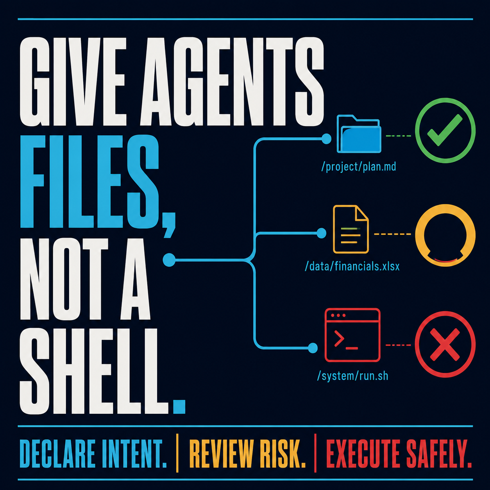
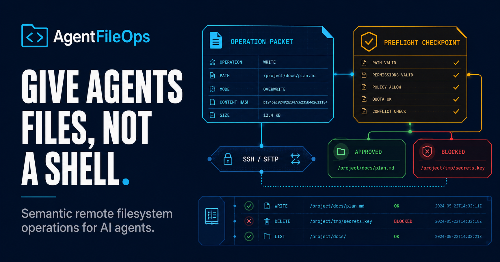

# AgentFileOps Visual Gallery

A small campaign system for explaining AgentFileOps as a safety-first remote filesystem protocol.

These bitmap visuals are used for product storytelling, onboarding, and documentation headers. Exact architecture and risk diagrams remain SVG-native so their labels and relationships stay reviewable.

**Illustrative assets** communicate the product category and narrative. **Authoritative assets**—schemas, tests, security policy, and labeled SVG diagrams—define what the system actually promises.

## Product hero

Use this image when introducing the core promise: an agent sends structured file intent through a guarded protocol instead of receiving an unrestricted shell.

## Protocol hero

This is the technically specific companion to the broad product hero: operation packet → pre-flight/review gate → SSH/SFTP → approved or blocked filesystem result → audit record. It is still illustrative; the repository SVGs and protocol sources remain authoritative.

## Product use cases

Use this image to explain the same semantic operation reaching different destinations—VPS, NAS, shared hosting, or another SSH/SFTP target—with approved and review-required paths made visible.

Pair it with the [use-case legend](use-case-legend.svg); the legend carries the exact meaning of blue intent, green approval, amber review, and red blocked paths.

## Typography poster — square

This square variant is intended for social posts, profile tiles, and presentation interstitials. It reinforces the product rule with an explicit intent/review/execute sequence.

## Typography poster — original

The primary message is deliberately short:

> Give agents files, not a shell.

The poster is suitable for project landing pages, social previews, talks, and repository documentation.

## Open Graph preview

This wide variant is composed for repository previews and link cards. It carries the operation packet, pre-flight checkpoint, SSH/SFTP rail, approved path, blocked path, and audit motif in one crop-safe frame.

## Lifecycle visual

Use this visual as the editorial companion to the canonical flow:

`intent → operation → resolution → risk review → backend execution → result → audit`

For exact technical documentation, pair it with:

- [Architecture diagram](../design/architecture.svg)
- [Data-flow diagram](../design/data-flow.svg)
- [Risk-level diagram](../design/risk-levels.svg)
- [Design system](../DESIGN_SYSTEM.md)

## Asset map

| Asset | Primary job | Recommended placement |
|---|---|---|
| `agentfileops-hero.png` | Establish the broad product category and promise | README, landing page, project overview |
| `agentfileops-protocol-hero.png` | Show packet, pre-flight, SSH/SFTP, decision, and audit | Architecture overview, technical docs |
| `agentfileops-use-cases.png` | Show provider-neutral deployment destinations | README, docs landing page, presentations |
| `use-case-legend.svg` | Define the exact color semantics of the use-case visual | Beside the use-case image |
| `agentfileops-typography-poster.png` | Make the product message memorable | Social preview, talks, docs cover |
| `agentfileops-poster-square.png` | Social/profile typography variant | Social posts, profile tiles |
| `agentfileops-social-og.png` | Crop-safe repository/link preview | Open Graph, link cards |
| `agentfileops-workflow-visual.png` | Explain the operation lifecycle at a glance | Examples, architecture overview, onboarding |

## Provenance

Generated on 2026-08-18 with the built-in image-generation workflow using the AgentFileOps navy/cyan/green visual language, amber review state, and red high-risk state. Generated imagery is illustrative; protocol claims, labels, and safety controls remain defined by the repository's Markdown, JSON, Rust, tests, and SVG sources.

### Authority boundary

| Asset type | Authority | Review rule |
|---|---|---|
| PNG campaign visuals | Illustrative | May explain or frame a concept; never define behavior |
| `use-case-legend.svg` | Presentation legend | Defines the legend only; not runtime behavior |
| Architecture/data-flow/risk SVGs | Documentation authority | Must stay aligned with protocol and audit records |
| Protocol schemas and Rust code | Behavioral authority | Source of truth for implementation |
| Tests and CI | Evidence authority | Required before claiming a capability is complete |
